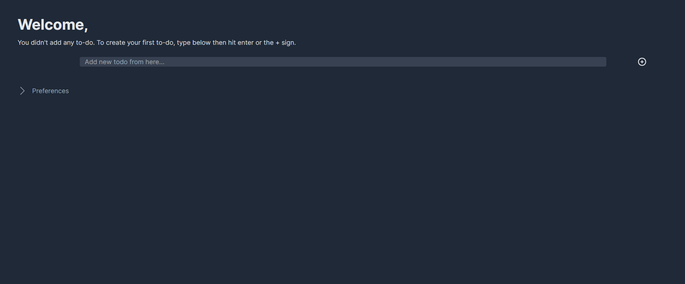

# To-Do List
 A simple to-do app built using Vue.js,Tailwindcss and Json Server.

In this to-do app, you can add new todos, edit them or delete them.
## Development

`npm install` - Install required npm packages for development.

`npm run dev` - Required command for development.

`npm run build` - Take a build for production step.

`npm run preview` - Required to see the last status of your project.
## Screenshots

